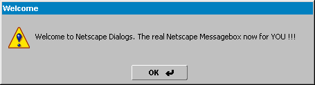



## NetscapeDialogs \- YOU MUST SEE IT \!\!\!

### Description

Welcome to this new activex control. NetscapeDialogs provides the new Messagebox and buttons of the Netscape 6 Browser Technology. FULL SOURCE CODE, BUT ALPHA PREVIEW !!!!

Including the graphics and the new msgbox-icons !

Copyright (c) 2000 Netscape , http://www.netscape.com

ActiveX Control, Copyright (c) 2000 Andreas Schwarz, http://www.futureprojects.de
 
### More Info
 

             |
---                |---
**Submitted On**   |2000-04-24 14:03:46
**By**             |[Andreas Schwarz](https://github.com/Planet-Source-Code/PSCIndex/blob/master/ByAuthor/andreas-schwarz.md)
**Level**          |Beginner
**User Rating**    |3.8 (15 globes from 4 users)
**Compatibility**  |VB 5\.0, VB 6\.0
**Category**       |[Custom Controls/ Forms/  Menus](https://github.com/Planet-Source-Code/PSCIndex/blob/master/ByCategory/custom-controls-forms-menus__1-4.md)
**World**          |[Visual Basic](https://github.com/Planet-Source-Code/PSCIndex/blob/master/ByWorld/visual-basic.md)
**Archive File**   |[CODE\_UPLOAD51514242000\.zip](https://github.com/Planet-Source-Code/andreas-schwarz-netscapedialogs-you-must-see-it__1-7541/archive/master.zip)

